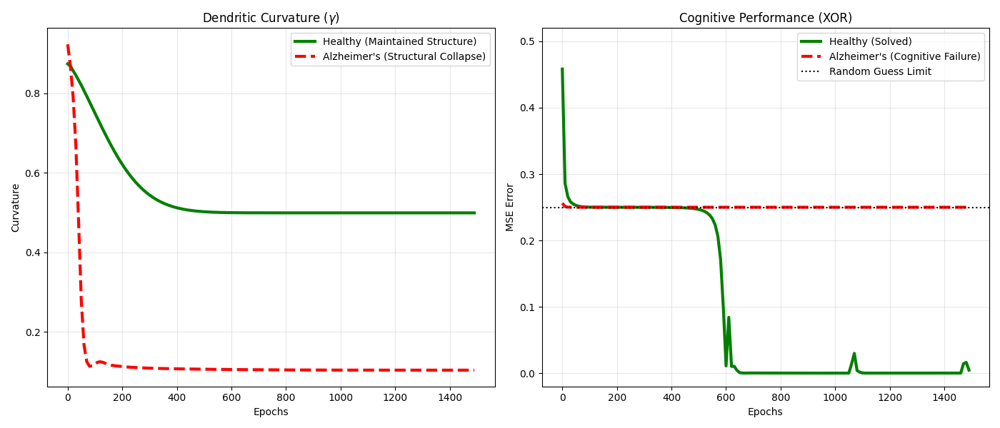
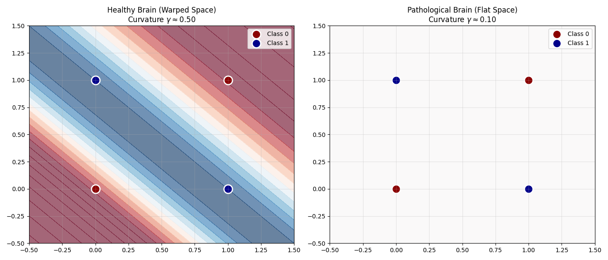

# Dynamic Curvature Networks: A Digital Brain that Warps its Geometry

This repository contains a PyTorch exploration of my **Curvature Adaptation Hypothesis (CAH)**. In that work, I explore the idea that the Martinotti-cell subtype of Somatostatin (SST) interneurons acts as the biological "switch" that unlocks hyperbolic geometries for the brain in order to more efficiently store incoming heirarchical data. 

In this project, I try to simulate a digital brain with a SST gating mechanism to see if it will maintain a hyperbolic regime while under simulated pressures (Metabolic Tax, Synaptic Budget, Survival)

You can find the CAH pre-print and the biophysical simulations that support it here:

https://doi.org/10.5281/zenodo.18615180

https://github.com/MPender08/dendritic-curvature-adaptation

Here's another pre-print where I attempt to design a computer chip with an SST-like gating mechanism:

https://doi.org/10.5281/zenodo.18718330


##  The Theory: Why Geometry Matters

Standard artificial neural networks operate in flat, Euclidean space. To solve complex, hierarchical problems (like XOR logic), they must brute-force the solution by growing massively large weights. 

Biological brains are restricted by a strict physical volume limit (a "Synaptic Budget"). To bypass this limit, the healthy brain might utilize Somatostatin (SST) interneurons to dynamically warp its internal manifold into **Hyperbolic Space**. This non-Euclidean geometry allows the brain to store infinite hierarchies and complex nested relationships using very little synaptic volume. 

However, maintaining this hyperbolic geometry has a metabolic cost.

##  The Simulation: A Biological Economy

This network is not forced to be flat or curved; it exists in a competitive evolutionary environment driven by three variables:

* **Synaptic Budget (`weight_decay`):** Prevents the network from brute-forcing problems with giant weights. It is physically constrained and must be efficient.
* **Metabolic Tax (`tax_rate`):** The thermodynamic cost of maintaining complex geometry.
* **Evolutionary Survival Pressure (`total_loss`):** This is the brain's 'Will to Live.' Survival Pressure forces it to burn energy to solve the puzzle.

**Biological Toggle (`gamma`):** A dynamic gate simulating the SST-interneuron, allowing the network to choose its own curvature ($c$) on the fly.

The network is caught in a tug-of-war: The **Metabolic Tax** pushes the brain to stay flat and save energy, while the **Survival Pressure** (Total Loss) forces it to warp space to solve the problem.

##  Results: Metabolic Parsimony & Geometric Collapse

(`run_brain_sim.py`)



### 1. The Healthy Brain (Metabolic Parsimony)
In the left figure, under a low metabolic tax, the healthy digital brain(Green) willingly pays the energy cost to maintain a hyperbolic shape (0.5 curvature). It warps its geometry, bypasses the synaptic budget, and successfully masters complex logic (0 MSE Error, right graph). 

Note in the right figure, once the healthy brain reaches 0 MSE Error, the `task_loss` gradient goes completely silent. The brain has achieved mastery and is now focusing on optimizing.

With the survival pressure gone, the only active force on the network's main weights is the Synaptic Budget (`weight_decay`). It acts like a slow gravitational pull, constantly trying to shrink the connection weights down to zero to save physical volume.

The brain slowly trims those synapses smaller and smaller to be as efficient as possible. Eventually, it trims them a fraction of a millimeter too far. The decision boundary shifts just enough that one of the XOR points slips to the wrong side. Those are the three MSE spikes seen in the visual.

The instant the error spikes, the Survival Pressure (`task_loss * 20.0`) violently wakes the optimizer up. The brain realizes, "Oh no, I forgot how to do this!" and instantly pumps energy back into those specific weights, shoving the decision boundary back into place and slamming the error back to zero.

Think of a physical skill, like playing a complex piece on a piano. Once you master it, if you don't practice, the brain undergoes synaptic pruning to save resources. The connections weaken. The next time you sit at the piano, you stumble on a chord (the error spike). That stumble sends a massive error signal to your brain, which instantly reactivates and strengthens that exact pathway to fix the mistake.

### 2. The Pathological Brain (Geometric Collapse)
When the metabolic tax is set artificially high (simulating the metabolic deficits seen in Alzheimer's and other neurodegenerative diseases), the energy required to maintain hyperbolic space becomes mathematically prohibitive. The manifold experiences a **Geometric Collapse**, snapping back to flat, Euclidean space.

The Alzheimer's digital brain(Red, dotted) has a metabolic tax rate that is 5,000 times heavier. If the Alzheimer's brain tries to rest at 0.5, it pays a massive penalty of `5.0 * (0.5^2)`. The AI optimizer looks at that massive energy drain and panics.

To escape that 5.0 tax, the optimizer aggressively shoves the internal weights of the `sst_gate` deep into negative numbers. It fights against the `weight_decay` just to force the Sigmoid gate to output a 0.0, desperately trying to turn off the geometry to survive the crushing metabolic cost.

### The Basal Geometric Tone (Resting Potential)

In the simulation, the healthy network does not return to a flat, Euclidean state (a curvature of absolute zero) after mastering a cognitive task. Instead, the interaction between the strict synaptic budget (`weight_decay`) and the SST-gate (`gamma`) establishes a resting equilibrium—a sustained curvature of 0.5.

This models a crucial biological mechanism: Basal Geometric Tone. Just as biological neurons must continuously burn energy to maintain a resting membrane potential to fire, the neural manifold must expend a baseline level of metabolic energy to maintain its structural readiness.

###  Modeling Cognitive Decline
When the pathological model collapses into Euclidean space, it loses its ability to process deep hierarchies and nested concepts. It is left with only flat, surface-level associative capabilities. 

In a clinical context, this mathematically models why neurodegeneration often preserves flat, associative memories (e.g., recognizing a familiar song or responding to a basic stimulus) but destroys the capacity for complex, hierarchical reasoning (e.g., navigating a new environment, tracking a nested conversation, or planning multi-step tasks). The cognitive rigidity observed in the disease is mirrored here as a literal geometric rigidity.

## Results: Decision Boundary Comparison

(`visualize_decision_boundary.py`)



### Left: The Healthy Brain (Curvature γ≈0.50)
By maintaining its Basal Geometric Tone, the healthy network actively warps its internal spatial representation into a hyperbolic manifold. The XOR logic gate is famously non-linear and impossible to solve with a single straight line in standard flat space. However, the curved geometry folds the data, allowing a simple, lightweight classifier to slice a single, elegant decision boundary right down the middle to perfectly isolate the classes.

### Right: The Pathological Brain (Curvature γ≈0.10)
Crushed by the heavy metabolic tax, the pathological brain is forced to abandon its resting curvature and collapse into flat space. Unable to maintain the complex geometry required to separate the data, the network's synaptic connections are annihilated by the baseline energy budget. The resulting "white fog" is a mathematically perfect visual of total cognitive failure and memory loss—the brain simply outputs a neutral, apathetic guess of 0.5 across the entire space.

##  Impact on Artificial Intelligence
This might demonstrate that highly efficient Artificial Intelligence will not be achieved purely by adding more layers to Euclidean networks. It points toward **Thermodynamic Intelligence**—systems that dynamically alter their own manifold geometry to maximize logical capacity while strictly adhering to energy constraints.

##  Installation & Usage

To run the simulation and generate the phase transition graphs or the decision boundary comparision yourself, you will need Python and a few dependencies.

1. **Clone the repository:**
   ```bash
   git clone https://github.com/MPender08/Curvature-Adaptation-Networks.git
   cd Curvature-Adaptation-Networks
   ```
2. **Install the required libraries:**
This project relies on torch and geoopt (for Riemannian optimization and hyperbolic manifolds).
```bash
   pip install torch matplotlib geoopt numpy
```
3. **Run the simulation and the comparison visualizer:**
```bash
python run_brain_sim.py
```
```bash
python visualize_decision_boundary.py
```
These will reproduce the visuals I shared. 


If you'd like to try it with your own seeds, or random seeds, use these settings at the top of run_brain_sim.py:

**NOTE:** There are some edge cases you might run into while trying your own custom seeds or randomized ones. I'll include a brief FAQ below.
```bash
# --- SEED CONTROL ---
# Try your own seeds, or turn off for random ones.
# The seed for the visual used in the README.me is 137
USE_LOCKED_SEED = True
LOCKED_SEED = 137
```

## Edge Case F.A.Q.

**1. Q:** The healthy digital brain never broke past the Random Guess Limit to achieve 0 MSE Error. What happened?

Sometimes, the healthy brain successfully warps space (γ≈0.50) but the initial weights project onto the hyperbolic manifold in perfect symmetry. The gradients cancel each other out, and the network is paralyzed by indecision. Even though it has the capacity to solve the puzzle, it gets stuck in a mental rut and simply guesses 0.5 for every coordinate, resulting in a completely blank, white decision boundary map.

**2. Q:** Why did the pathological digital brain manage to achieve 0 MSE Error?

Occasionally, you will find a seed where the Pathological Brain suddenly plunges to 0.0 late in the simulation.

When the pathological brain's geometry violently collapses under the metabolic tax (γ≈0.10), that collapse will sometimes break the symmetry. Freed from the trap, it wanders blindly through nearly flat space for (usually) hundreds of epochs (Euclidean Drift) until it stumbles onto a crude, highly specific spatial slice to solve the problem.

Both of these edge cases can be seen as Analysis Paralysis and Rote Memorization. The healthy brain had the hyperbolic shape to achieve 0 MSE Error, but it overthought the problem and froze. The pathological brain lost the ability to understand deep geometry, but through exhaustive, repetitive trial-and-error over a massive timeframe, it brute-forced a surface-level workaround. Note that a healthy brain usually achieves elegant mastery in <600 epochs, whereas the pathological brute-force workaround usually requires many more epochs of sheer computational exhaustion.
   
## Acknowledgements 

This author of this research used Gemini 3 Flash and Gemini 3 Pro during the creation of this simulation code.
